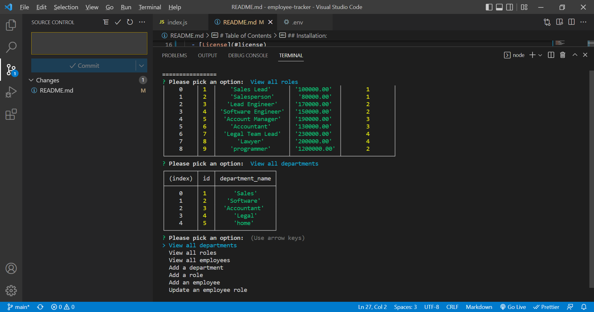

  # Employee Tracker

  
  ## Description:

  

   employee tracker app that will add departments, roles and employess to the database which can be accesed when needed. a menu will displayed that will have list asking specific questions relating to the inquiry.

  # Table of Contents

  - [Walkthrough](#walkthrough)
  - [Installation](#installation)
  - [Usage](#usage)
  - [Credits](#credits)
  - [License](#license)
  - [Contribution](#contributing)
  - [Screenshot](#screenshot)
  - [Contact](#contacts)

  
  ## Installation:

   * run ```npm install``` in terminal to install dependencies. 
   * run ```node index.js``` in terminal to run the app 
   * follow prompts and answer relevant questions
.

  ## Walkthrough
  [WalkThrough Video](https://watch.screencastify.com/v/3nDpoPoBvc4GvFoCRHLc)
  
  ## Technologies
  - JavaScript
  - Nodejs

  ## Usage:

  This app will let you create a employee tracker where you can add delete and assign roles,departments and employees


  ## Credits:

  Made by Bader Munir


  ## License:

  For more information about licenses, please visit:

  [License](https://opensource.org/licenses/MIT)


  ## Contributing:
  
  It is open source

  ## Screenshot:

  

  
  ## Contact:


  - [Github Profile](https://github.com/XBaderM)

  - [Email](bader.munir18@googlemail.com)
  
 

